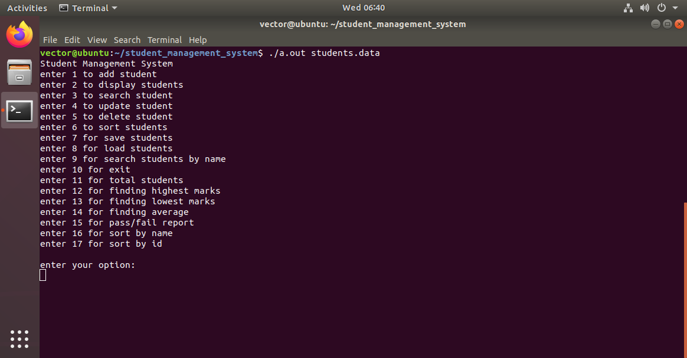

# Student Management System

A C-based Student Management System developed using structures, dynamic memory allocation, file handling, and functions.

## Features

- Add student
- Display students
- Search student by ID
- Search student by name
- Update student
- Delete student
- Sort students
- Save and load student records
- Calculate highest, lowest and average marks
- Pass/Fail status
- Input validation
- Command-line argument handling

## Technologies Used

- C Programming
- Structures
- Dynamic Memory Allocation
- File Handling
- Command Line Arguments
- GCC/CC Compiler
## Output

### Main Menu

### Add Student

### Display Student

### Search Student

### Update Student

### Delete Student

### Save Students

### Load Students

### Highest Marks

